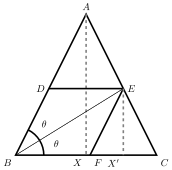

# Want to study at Chennai Mathematical Institute?

The B.Sc. program at CMI is the best of its kind in India. Cracking its entrance exam requires strong problem-solving skills in math.
We give solutions to the exam's past problems that are more insightful than the official solutions.
{: .fs-5 .fw-300 }

<!--
[View Topics](/docs/topics){: .btn .fs-5 .mb-4 .mb-md-0 }
-->

---

## Sample questions

### Sum of a finite series [2019]

The sum \\( S = 1 + 111 + 11111 + \cdots + \underbrace{11 \cdots 1}_{2k+1} \\)

#### Solution

\begin{align}
9S &= 9 + 999 + 99999 + \cdots + \underbrace{99 \cdots 9}_{2k+1} \\\\\\\\
 &= (10-1) + (1000-1) + \cdots + (100^{2k+1}-1) \\\\\\\\
 &= \frac{10(100^{k+1} - 1)}{99} - (k+1) \\\\\\\\
S&= \frac{ 10^{2k+3} - 99k - 109}{99\times 9}
\end{align}

*The official solution gives only the answer*

### Is a square? [2019]
For what values of \\( n \\) is \\( n^6 + n^4 + 1 \\) a square of a natural number?

#### Solution

We will handle odd and even cases separately.

*Lemma.* Every odd square is \\(1 \bmod 8\\).

\\[ (2k+1)^2=4k^2+4k+1=4(k^2+k)+1 \\]

Since \\( 4(k^2+k) \\) is divisible by 8, the lemma follows. \\(\square\\)

*Case 1.* If \\(n\\) is odd, then the given expression \\(S:=n^6+n^4+1\\) cannot be a square since \\(S\equiv 3\pmod 8\\). Hence \\(n\\) is not odd.

*Case 2.* If \\(n=2\\), we have \\(S=81\\), so we have one solution. If \\(n>2\\) and is even we have:

\\[ \left(n^3+\frac{n}{2}\right)^2=n^6+n^4+\frac{n^2}{4}> S > n^6+n^4-2n^3+\frac{n^2}{4}-n+1=\left(n^3+\frac{n}{2}-1\right)^2 \\]

\\( S \\) is a number strictly inbetween two consecutive squares, so there are no solutions for \\(n>2\\).

*Official solution*

### Rhombus within a triangle [2010]

In an isoceles triangle ABC  with A at the apex, the height and the base are both equal to
1cm. Points D, E and F are chosen from each side such that BDEF is a rhombus.  Find the length of the side of this rhombus.

#### Solution

We want to find the side length of the rhombus \\(BDEF\\).  We will find the length of \\(EF\\). Let \\( AX \\) and \\( EX' \\) be the perpendiculars of triangles \\(ABC\\) and \\(EFC\\), respectively.

We know that \\( FX'= EX'/2 \\)  since \\( ABC \cong EFC \\).

\begin{align}
EF &= \frac{\sqrt{5}}{2}EX' \hskip{3pt} \text{since }EX'F\text{ is a right angled triangle}
\label{eq:triangle}\tag{1}
\end{align}

All we have to do is find the length of \\( EX' \\).

\begin{align}
\tan \theta & = \frac{EX'}{BX'} \\\\\\\\
\tan \theta & = \frac{EX'}{BC-X'C} \\\\\\\\
& = \frac{EX'}{1 - EX'/2} \hskip{5pt} \text{ since } ABX \cong EFX' \\\\\\\\
EX' & = \frac{2\tan \theta}{2+\tan \theta} \hskip{5pt} \text{ by rearranging } \label{eq:ex}\tag{2} \\\\\\\\
\\\\\\\\
\\\\\\\\
\tan 2\theta & = \frac{AX}{BX} = \frac{2\tan \theta}{1-\tan^2\theta} \\\\\\\\
2 & = \frac{2\tan \theta}{1-\tan^2\theta} \\\\\\\\
\tan \theta & = \frac{-1+\sqrt{5}}{2} \\\\\\\\
EX' & = (2\sqrt{5}-4) \hskip{5pt} \text{by substituting the value of }\tan \theta\text{ in \eqref{eq:ex}}
\\\\\\\\
\\\\\\\\
EF & = \frac{\sqrt{5}}{2}(2\sqrt{5}-4) \hskip{5pt} \text{From \eqref{eq:triangle}} \\\\\\\\
 & = (5-2\sqrt{5})
\end{align}

Hence the side length of the rhombus is  \\( (5-2\sqrt{5}) \\) cm.

